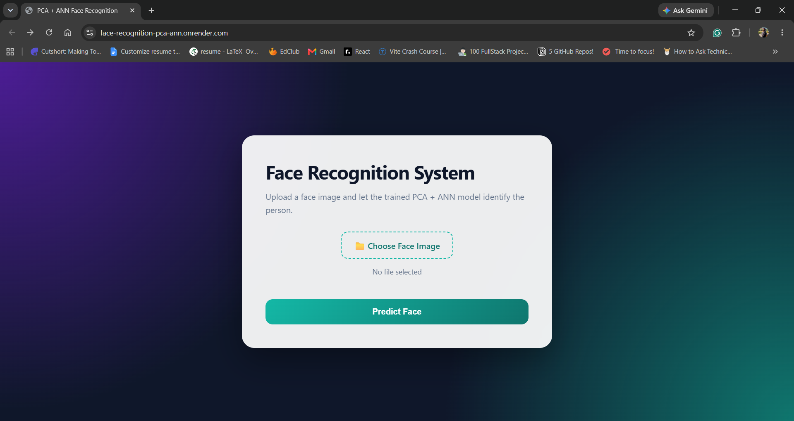
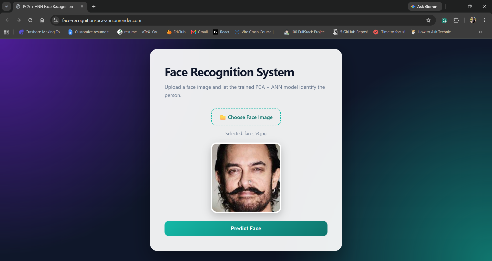
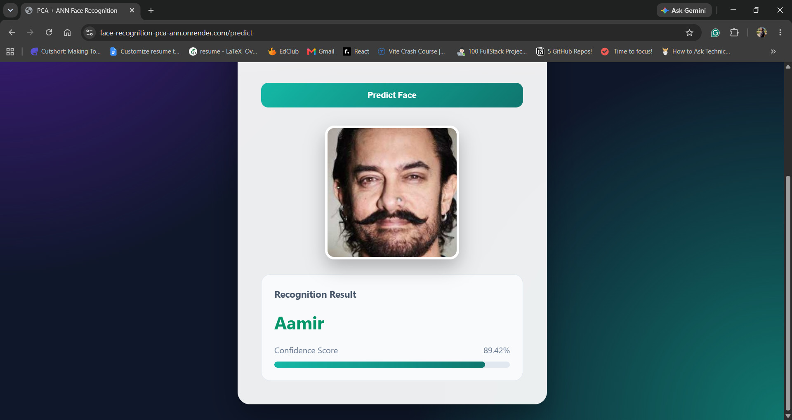

# 🧠 PCA + ANN Face Recognition System

An AI-powered face recognition web application built using **Principal Component Analysis (PCA)** for feature extraction and an **Artificial Neural Network (ANN)** for face classification. The application allows users to upload a face image and predicts the identity of the person along with a confidence score through a clean and responsive web interface.

🌐 **Live Demo:** https://face-recognition-pca-ann.onrender.com

---

## 📖 Project Overview

This project demonstrates a complete machine learning pipeline for face recognition using traditional AI techniques instead of deep learning.

The workflow consists of:

- Image preprocessing
- Face vector generation
- Principal Component Analysis (PCA) for dimensionality reduction
- Artificial Neural Network (ANN) for classification
- Flask web application for user interaction
- Deployment on Render

The project highlights how PCA can significantly reduce the dimensionality of facial images while preserving important facial features, making the classification process faster and more efficient.

---

## 📸 Application Screenshots

### 🏠 Home Page



---

### 📤 Image Upload



---

### ✅ Recognition Result



---

## ✨ Features

- Upload face images through a simple web interface
- Real-time face recognition
- PCA-based dimensionality reduction
- ANN-based face classification
- Confidence score visualization
- Unknown face rejection using confidence threshold
- Image preview before prediction
- Responsive modern UI
- Deployed online using Render

---

## 🛠️ Tech Stack

### Programming Language

- Python

### Machine Learning

- Principal Component Analysis (PCA)
- Artificial Neural Network (ANN)
- NumPy
- Scikit-learn
- OpenCV

### Backend

- Flask
- Gunicorn

### Frontend

- HTML5
- CSS3
- JavaScript

### Deployment

- Render

---

## 🧠 How It Works

### Step 1 — Image Upload

The user uploads a face image through the web application.

↓

### Step 2 — Image Preprocessing

The uploaded image is

- converted to grayscale
- resized to 100 × 100 pixels
- flattened into a feature vector

↓

### Step 3 — PCA Feature Extraction

Principal Component Analysis transforms the high-dimensional image into a compact feature representation (Eigenfaces).

↓

### Step 4 — Feature Scaling

The PCA features are normalized using the trained scaler.

↓

### Step 5 — ANN Prediction

The trained Artificial Neural Network predicts the most likely identity.

↓

### Step 6 — Confidence Calculation

Prediction confidence is calculated.

If the confidence is below the predefined threshold, the face is labeled as **Not Enrolled**.

↓

### Step 7 — Display Result

The application displays

- Predicted Person
- Confidence Score
- Progress Bar

---

## 📊 Model Details

### Dataset

- Total Persons: **9**
- Total Images: **450**
- Images per Person: **50**
- Image Size: **100 × 100 pixels**

---

### Train-Test Split

- Training Images: **270**
- Testing Images: **180**

---

### PCA

Original Features

100 × 100 = **10,000**

Reduced Features

**75 Principal Components**

Dimension Reduction

**99.25%**

---

### ANN Configuration

Hidden Layers

```
128 → 64
```

Activation Function

```
ReLU
```

Optimizer

```
Adam
```

Early Stopping

```
Enabled
```

---

## 📈 Performance

| Metric | Value |
|----------|---------|
| Best Accuracy | **60%** |
| Principal Components | **75** |
| Confidence Threshold | **0.75** |
| Unknown Face Rejection | **100% (10/10)** |

---

## 📁 Project Structure

```
face-recognition-pca-ann/
│
├── app.py
├── requirements.txt
├── README.md
│
├── models/
│   ├── ann_model.pkl
│   ├── eigenfaces.npy
│   ├── scaler.pkl
│   ├── mean_face.npy
│   └── label_map.pkl
│
├── src/
│   ├── train.py
│   ├── predict.py
│   ├── preprocess.py
│   └── utils.py
│
├── templates/
│   └── index.html
│
├── static/
│   └── style.css
│
├── uploads/
│
├── screenshots/
│   ├── home.png
│   ├── upload.png
│   └── result.png
│
└── dataset/
```

---

## 🚀 Installation

Clone the repository

```bash
git clone https://github.com/amritalakshmim/face-recognition-pca-ann.git
```

Move into the project directory

```bash
cd face-recognition-pca-ann
```

Create a virtual environment

```bash
python -m venv venv
```

Activate the virtual environment

Windows

```bash
venv\Scripts\activate
```

Install dependencies

```bash
pip install -r requirements.txt
```

Run the Flask application

```bash
python app.py
```

Open

```
http://127.0.0.1:8000
```

---

## 💻 Usage

1. Open the web application.
2. Click **Choose Face Image**.
3. Select a face image.
4. Preview the selected image.
5. Click **Predict Face**.
6. View the predicted identity and confidence score.

---

## 🔮 Future Improvements

- Face detection before recognition
- Webcam support
- Live video recognition
- Multiple face recognition
- User enrollment through the web interface
- Database integration
- Improved recognition accuracy using CNN models
- Docker support
- CI/CD pipeline
- User authentication

---

## 👩‍💻 Author

**Amritalakshmi M**

GitHub

https://github.com/amritalakshmim

LinkedIn

https://www.linkedin.com/in/amritalakshmim/

---

## 📄 License

This project is intended for educational and research purposes.

---

## ⭐ Support

If you found this project helpful, consider giving it a ⭐ on GitHub.

It helps others discover the project and motivates further improvements.